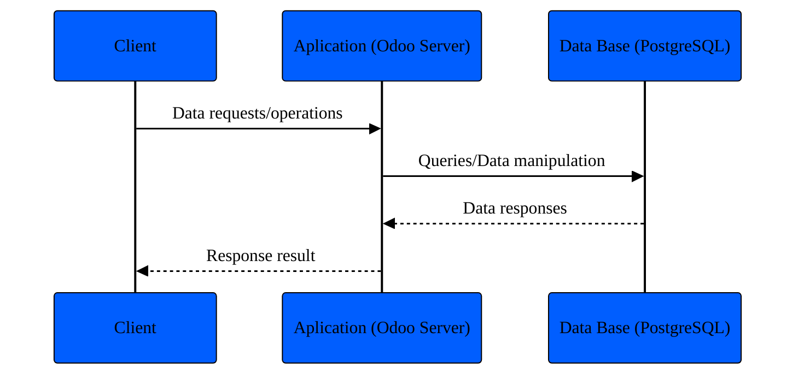
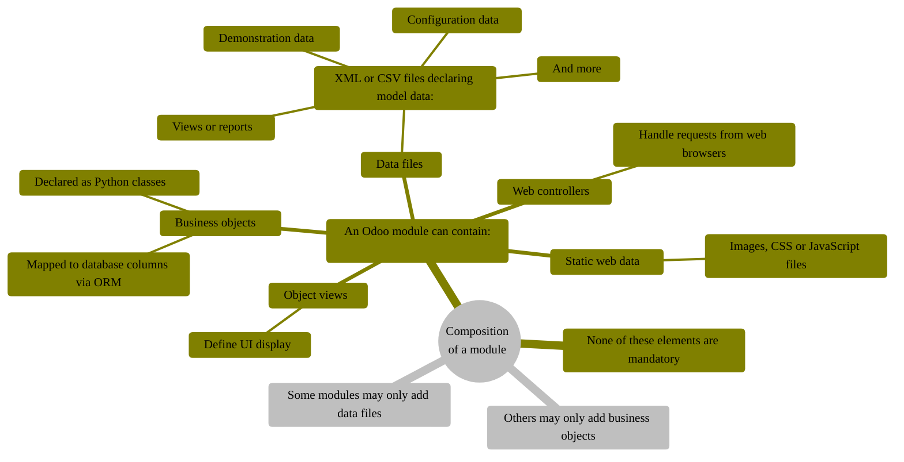

# Introduction to Odoo

## Setup

- Install Odoo
  - In order to do this we need to clone the odoo/odoo repository in your
  local machine.
  ```bash
  $ git clone https://github.com/odoo/odoo.git
  ```
  - Then we need to install the dependencies.
  I tryied to run the pip install command to instal the requierements.txt.
  But it didn't work, so I installed the dependencies manually.
  ```bash
  $ pip install -r requirements.txt
  ```
  That command will help us a lot because it will show you all the dependencies
  that you need to install in order to avoid any kind of conflicts, install
  each one of the libraries, headers, system dependencies and then run the
  pip requierements command again and it will fine to go.

- Install Postgresql
    - Odoo works fine with postgresql so in order to create a database we need
    to install postgresql, you can follow the installation steps in the official
    postgresql webpage [LINK](https://www.postgresql.org/download/linux/ubuntu/)

- Create a user
    - According to the Postgresql documentation, it will come with a default
    account with all permissions, it will be through this account that we can
    create our user. so in order to create a user we need to run the following
    commands
    ```bash
    $ sudo -u postgres psql
    psql (16.3 (Ubuntu 16.3-1.pgdg20.04+1))
    Type "help" for help.

    postgres=# CREATE USER odoo WITH PASSWORD 'odoo';
    postgres=# ALTER USER odoo WITH SUPERUSER;
    ```

> [!NOTE]
> The odoo postgres superuser is just an example, remember to change it to your
> own ubuntu's system user, this will avoid possible errors when running odoo's
> server.

## How to run odoo's server?
Once you have installed all the necessary dependencies and manage to install
the requirements, you have to execute the following command:
```bash
$ python odoo-bin --addons-path odoo/addons,addons -v odoo
```
If everything has gone well, you will have the following output:
```bash
2024-07-03 04:05:04,877 43777 INFO ? odoo: Odoo version 17.0
2024-07-03 04:05:04,877 43777 INFO ? odoo: addons paths: ['/home/nivekyeff/proyectos/odoo/odoo/odoo/addons', '/home/nivekyeff/.local/share/Odoo/addons/17.0', '/home/nivekyeff/proyectos/odoo/odoo/addons']
2024-07-03 04:05:04,877 43777 INFO ? odoo: database: default@default:default
2024-07-03 04:05:04,970 43777 INFO ? odoo.addons.base.models.ir_actions_report: You need Wkhtmltopdf to print a pdf version of the reports.
2024-07-03 04:05:05,072 43777 INFO ? odoo.service.server: HTTP service (werkzeug) running on nivekyeff-ThinkPad-T480:8069
```
As you can see, your odoo server will be running locally on port 8069, now you
only need to access it from the browser, simply enter the url `localhost:8069`
and you can start the database configuration with the odoo interface.

<p align="center">


</p>

## Server framework 101

### Architecture

Odoo follows a multitier architecture meaning that the presentation, the
business logic and the data storage are separated.


<p align="center">


</p>

#### Multitier architecture application



### Odoo modules
Odoo modules are the main building blocks of the Odoo application. They are
independent pieces of code that can either add brand new business logic to an
Odoo system or alter an extend existing business logic.

Modules may also be referred to as `addons` and the directories where Odoo
server finds them form the  `addons_path`

#### Compositio of a module


### Module structure

Each module is a directory within a module directory it is declared by its
`__manifest__.py`.

#### Simplified version:
```bash
module
├── models
│   ├── *.py
│   └── __init__.py
├── data
│   └── *.xml
├── __init__.py
└── __manifest__.py
```
