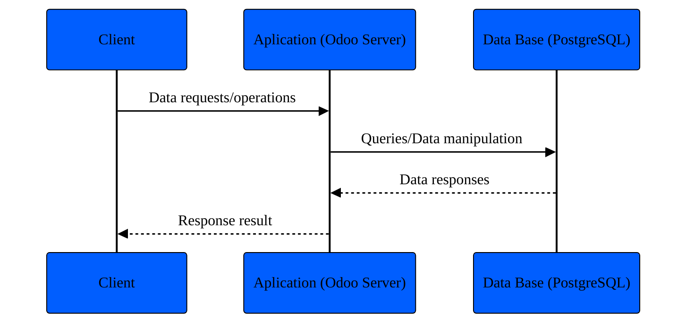

# Introduction to Odoo

## Server framework 101

### Architecture

Odoo follows a multitier architecture meaning that the presentation, the
business logic and the data storage are separated.

#### Multitier architecture application

