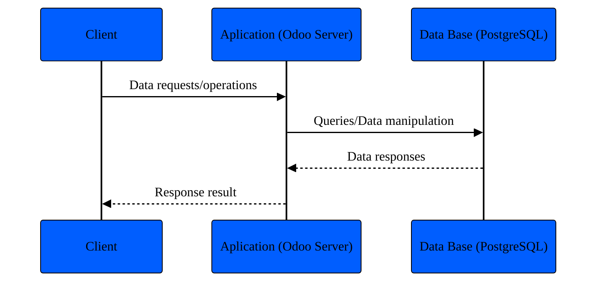
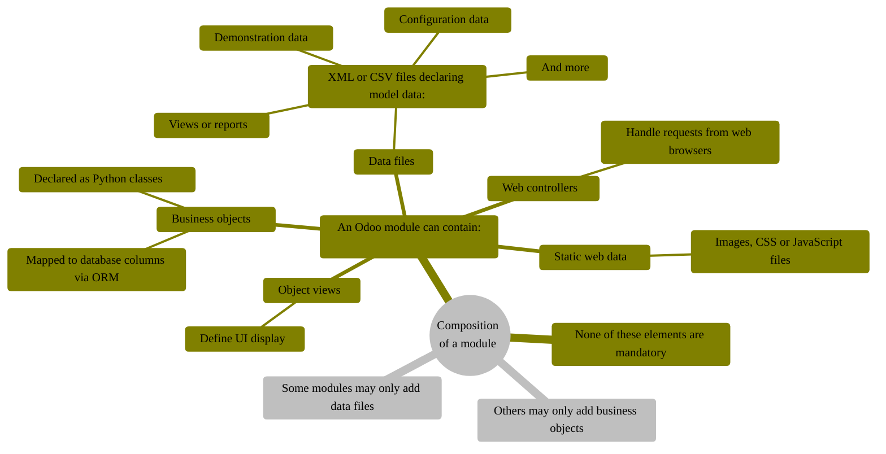

# Introduction to Odoo

## Server framework 101

### Architecture

Odoo follows a multitier architecture meaning that the presentation, the
business logic and the data storage are separated.

#### Multitier architecture application

### Odoo modules
Odoo modules are the main building blocks of the Odoo application. They are
independent pieces of code that can either add brand new business logic to an
Odoo system or alter an extend existing business logic.

Modules may also be referred to as `addons` and the directories where Odoo
server finds them form the  `addons_path`

#### Compositio of a module

